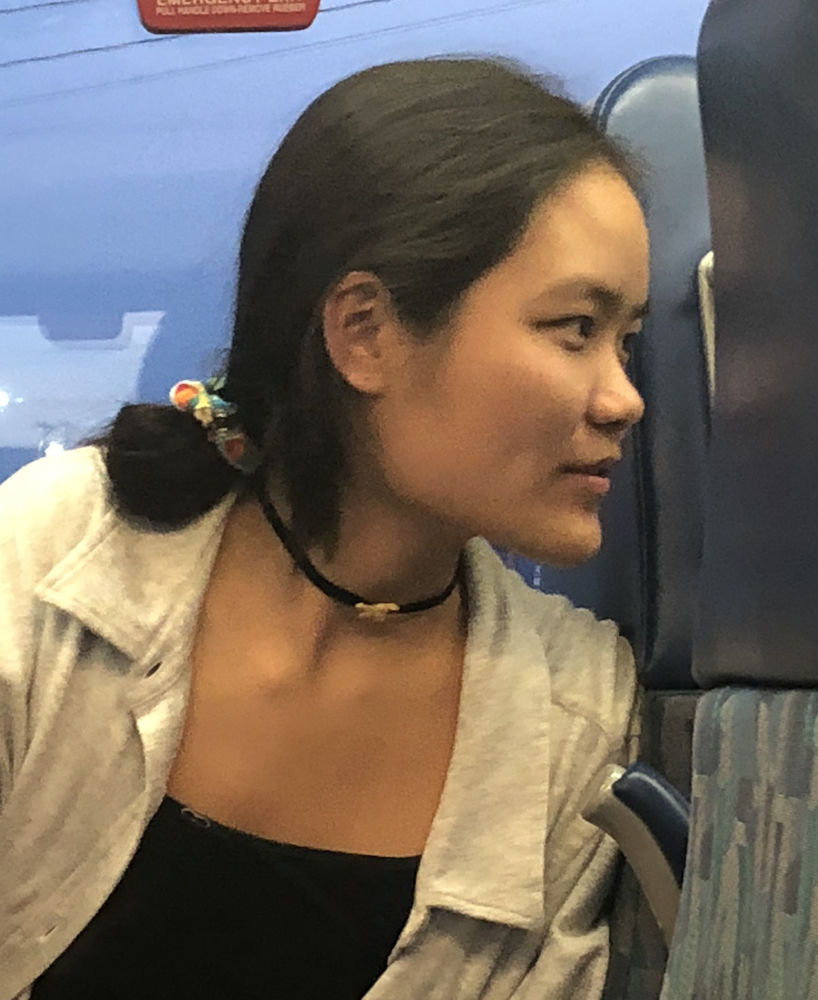

  <head>
    <meta charset='UTF-8'/>
    <meta name="viewport" content="width=device-width, initial-scale=1.0">
    <link rel='stylesheet' href='styles.css'/>
    <title>Becky Zhang</title>
  </head>

  <body>
    <header>
      <h1>Becky Zhang</h1>
    </header>

    

      <sidebar>
        
<a href='index.md'>Home</a>

        
<a href='writing.md'>Writing</a>

        
<a href='editing.md'>Editing</a>

        
<a href='connect.md'>Connect</a>

      </sidebar>

      

        

          Becky Zhang grew up in Hong Kong and studies English and Computer Science at Pomona College.
          She is an editorial intern at the LA Review of Books.
        

        
      

    

    </body>
